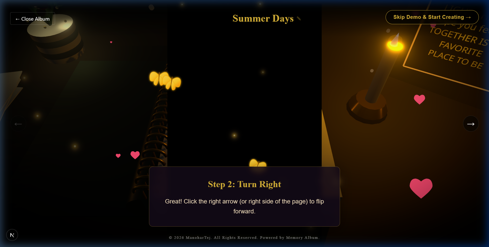
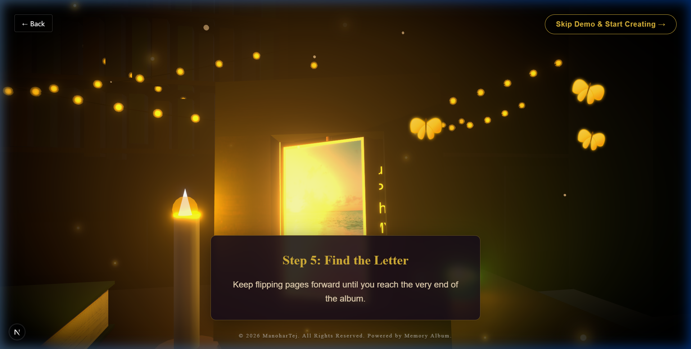
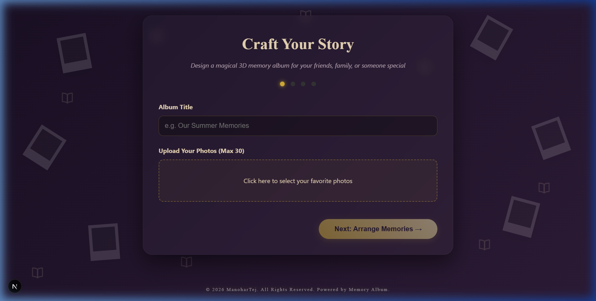

<div align="center">
  
  
  # 📖 Memory Album 
  
  **An immersive, interactive 3D WebGL memory book experience.**
</div>

---

## 🌟 Overview
Memory Album transforms the traditional concept of a digital photo gallery into a cozy, interactive 3D study room. Built with **Next.js**, **React Three Fiber**, and **GSAP**, it offers a stunningly atmospheric environment where users can physically interact with a digital photo album, flip pages, and experience their memories surrounded by dynamic lighting, animated butterflies, and glowing fireflies.

## 🚀 Features
- **Interactive 3D Study Room**: Explore a fully modeled, cozy 3D desk environment with dynamic lighting.
- **Physical Memory Book Mechanics**: Flip through album pages with fluid, physics-based 3D animations using GSAP and Anime.js.
- **Atmospheric Post-Processing**: Enjoy a premium visual experience with real-time WebGL Bloom, Vignette, and ambient noise overlays.
- **Interactive Props**: Click on the wooden photo frame to open its doors and zoom into specific memories. 
- **Organic Animations**: Watch physics-driven 3D butterflies and fireflies flutter naturally around the environment.
- **In-App Canvas Recorder**: Capture screenshots or record WebM video walkthroughs directly from the 3D scene without external software.

---

## 📸 Gallery & Walkthrough

<table>
  <tr>
    <td align="center"><b>Dashboard / Desk View</b></td>
    <td align="center"><b>Book Interactions</b></td>
  </tr>
  <tr>
    <td></td>
    <td></td>
  </tr>
  <tr>
    <td align="center"><b>Special Memories</b></td>
    <td align="center"><b>Demo Walkthrough</b></td>
  </tr>
  <tr>
    <td></td>
    <td></td>
  </tr>
</table>

---

## 🏗️ Technical Architecture
This application cleanly separates the 3D WebGL logic from the 2D UI overlays using Zustand for seamless cross-layer communication.

For a detailed architecture diagram, see [Architecture Documentation](docs/architecture.md).

For an in-depth code and technical breakdown, see the [Project Analysis](docs/PROJECT_ANALYSIS.md).

### 🛠️ Tech Stack
- **Framework**: Next.js (App Router), React 18/19
- **3D Engine**: Three.js, React Three Fiber (`@react-three/fiber`), React Three Drei
- **Post-Processing**: React Three Postprocessing (`@react-three/postprocessing`)
- **Animation**: GSAP (GreenSock), Anime.js
- **State Management**: Zustand
- **Styling**: Tailwind CSS

---

## 💻 Installation & Setup

1. **Clone the repository:**
   ```bash
   git clone https://github.com/ManoharTej/Memory-Albumn.git
   cd Memory-Albumn
   ```

2. **Install dependencies:**
   ```bash
   npm install
   ```

3. **Start the development server:**
   ```bash
   npm run dev
   ```

4. **Experience the app:**
   Open [http://localhost:3000](http://localhost:3000) in your browser.

---

## 📈 Future Improvements
- **Backend Integration**: Add a CMS or Firebase integration to allow dynamic user-uploaded memories.
- **Multiplayer**: Implement WebSockets to allow multiple users to explore the study room together.
- **Spatial Audio**: Add 3D positional audio for page turns and crackling candles to enhance immersion.

---
*Maintained by [Manohar Tej](https://github.com/ManoharTej)*
