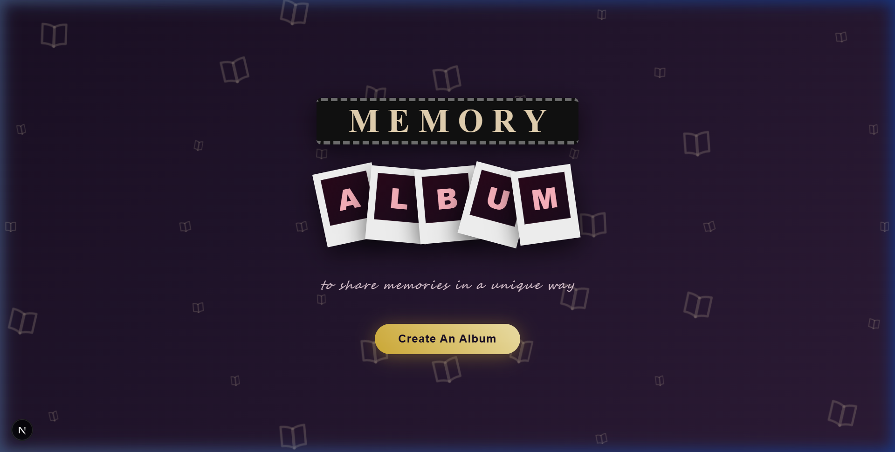
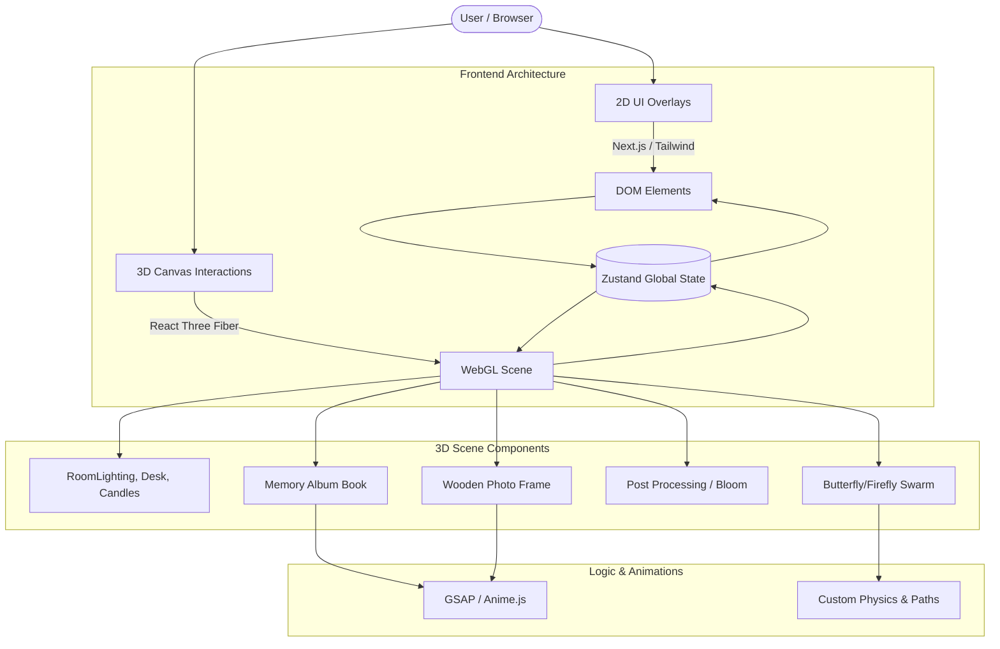

<div align="center">
  
  <br/><br/>
  
  # 🦋 Memory Album 
  **An immersive, interactive 3D WebGL memory book experience.**
  
  [](https://vercel.com/new/clone?repository-url=https://github.com/ManoharTej/Memory-Albumn)
  
  <br/>
  
  
  
  
  
  
  

  <br/>
</div>

---

## 🌟 Overview
Memory Album transforms the traditional concept of a digital photo gallery into a cozy, interactive 3D study room. Built with **Next.js**, **React Three Fiber**, and **GSAP**, it offers a stunningly atmospheric environment where users can physically interact with a digital photo album, flip pages, and experience their memories surrounded by dynamic lighting, animated butterflies, and glowing fireflies.

## 🚀 Key Features
- **Interactive 3D Study Room**: Explore a fully modeled, cozy 3D desk environment with dynamic lighting.
- **Physical Memory Book Mechanics**: Flip through album pages with fluid, physics-based 3D animations using **GSAP** and **Anime.js**.
- **Atmospheric Post-Processing**: Enjoy a premium visual experience with real-time WebGL Bloom, Vignette, and ambient noise overlays.
- **Interactive Props**: Click on the wooden photo frame to open its doors and zoom into specific memories. 
- **Organic Animations**: Watch physics-driven 3D butterflies and fireflies flutter naturally around the environment.
- **In-App Canvas Recorder**: Capture screenshots or record WebM video walkthroughs directly from the 3D scene without external software.

---

## 🎥 Video Walkthrough Demo
*A complete walkthrough of the Memory Album experience from the browser.*

<div align="center">
  
</div>

---

## 📸 Gallery

<table>
  <tr>
    <td align="center"><b>1. Welcome Area</b></td>
    <td align="center"><b>2. Craft Your Story</b></td>
    <td align="center"><b>3. Arrange Memories</b></td>
  </tr>
  <tr>
    <td></td>
    <td></td>
    <td></td>
  </tr>
  <tr>
    <td align="center"><b>4. Desk Overview</b></td>
    <td align="center"><b>5. The Memory Book</b></td>
    <td align="center"><b>6. Interactive Photo Frame</b></td>
  </tr>
  <tr>
    <td></td>
    <td></td>
    <td></td>
  </tr>
</table>

---

## 🏗️ Technical Architecture

This application cleanly separates the 3D WebGL logic from the 2D UI overlays using **Zustand** for seamless cross-layer communication.



For an in-depth code and technical breakdown, see the [Project Analysis Documentation](docs/PROJECT_ANALYSIS.md).

---

## 💻 Local Setup & Deployment

1. **Clone the repository:**
   ```bash
   git clone https://github.com/ManoharTej/Memory-Albumn.git
   cd Memory-Albumn
   ```

2. **Install dependencies:**
   ```bash
   npm install
   ```

3. **Start the development server:**
   ```bash
   npm run dev
   ```

4. **Deploying on Vercel:**
   The fastest way to deploy this project is via the [Vercel CLI](https://vercel.com/cli) or connecting your GitHub repo on the Vercel Dashboard.
   ```bash
   npx vercel --prod
   ```

---
## ⚖️ License
Copyright (c) 2026 Manohar Tej. All Rights Reserved. 

*Proprietary and Confidential. Unauthorized copying, modification, or distribution is strictly prohibited.*
