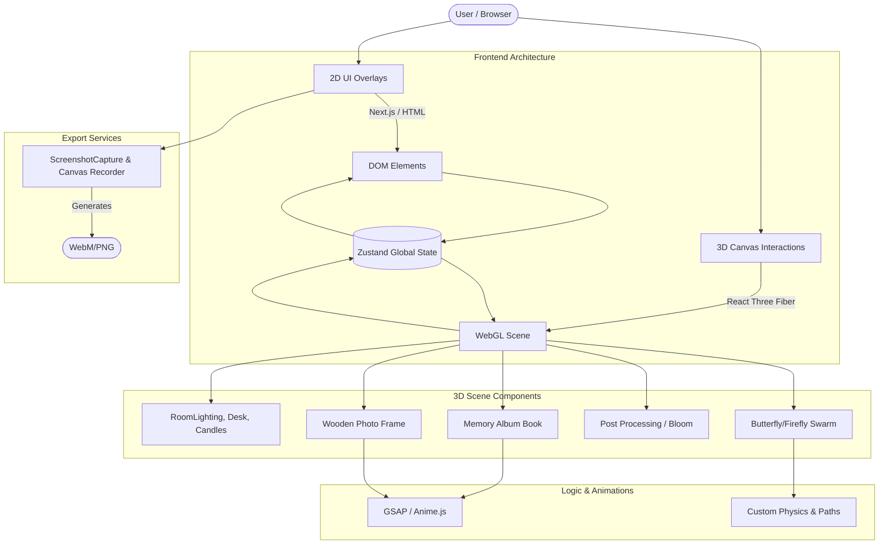

# Architecture

The system is separated into three main layers: The React/Next.js 2D UI Layer, the Zustand State Management Layer, and the React Three Fiber (R3F) 3D Canvas Layer.

```mermaid
graph TD
    User([User / Browser]) --> UI[2D UI Overlays]
    User --> Canvas[3D Canvas Interactions]

    subgraph "Frontend Architecture"
        UI --> |Next.js / HTML| DOM[DOM Elements]
        Canvas --> |React Three Fiber| WebGL[WebGL Scene]

        DOM --> Store[(Zustand Global State)]
        WebGL --> Store
        Store --> DOM
        Store --> WebGL
    end

    subgraph "3D Scene Components"
        WebGL --> Environment[RoomLighting, Desk, Candles]
        WebGL --> Book[Memory Album Book]
        WebGL --> Frame[Wooden Photo Frame]
        WebGL --> Effects[Post Processing / Bloom]
        WebGL --> Swarm[Butterfly/Firefly Swarm]
    end

    subgraph "Logic & Animations"
        Book --> GSAP[GSAP / Anime.js]
        Frame --> GSAP
        Swarm --> Math[Custom Physics & Paths]
    end

    subgraph "Export Services"
        UI --> Recorder[ScreenshotCapture & Canvas Recorder]
        Recorder --> |Generates| Output([WebM/PNG])
    end
```
